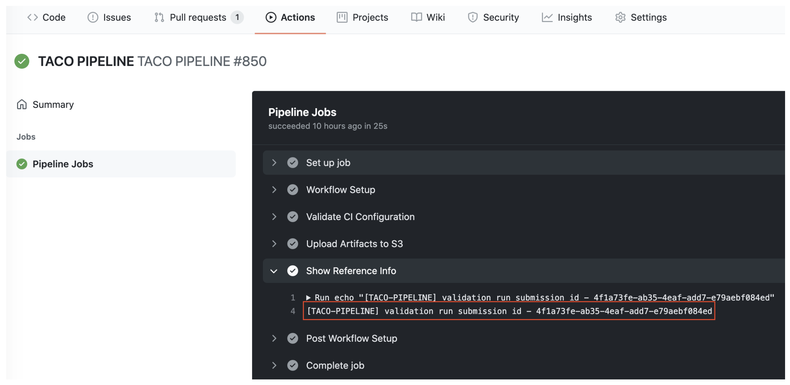
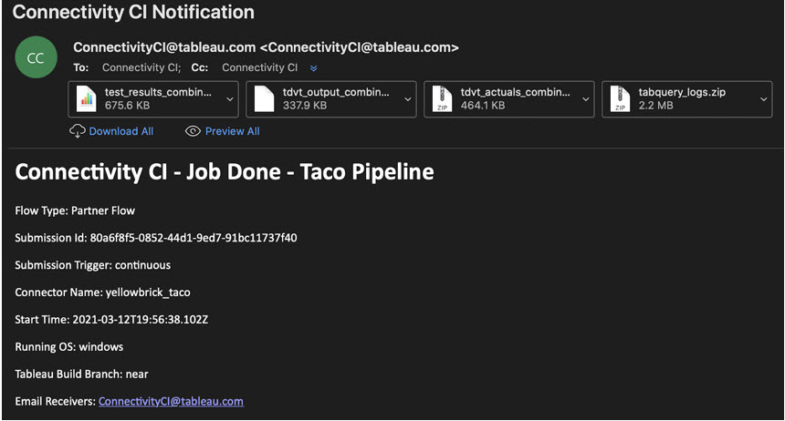
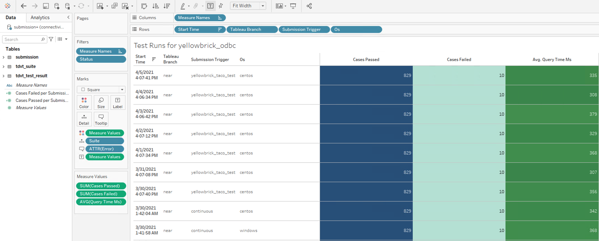

To test your connector, you must tag a commit with a version and then commit the tag to the repo.
## Create a tag
When you [create a tag](https://docs.github.com/en/desktop/contributing-and-collaborating-using-github-desktop/managing-commits/managing-tags) for your connector, you start the CI pipeline. The results of the pipeline are emailed to the address you [configured earlier](./ci_configuration.html).

 * Make sure that your tag is the folder path to the ci.json config. 
   For example, `taco.postgres-unpackaged-jdbc-example`.
 * Append a unique suffix to the tag. We recommend that you use the *date* and then a *build number*.
   For example, `0824.01`.
 * Every tag must be unique. To create more builds, increase the tag build number by 1. For example, `01`, `02`, `03`.

The following sample tag for a connector in the `taco.postgres-unpackaged-jdbc-example` folder will start the pipeline: 

```taco.postgres-unpackaged-jdbc-example.0824.01```

## Monitor the job

After creating a release, GitHub starts the action workflow for the pipeline. The workflow details contain a generated submission ID generated. You can use this ID to refer to the validation results.

To monitor the pipeline workflow, go to **Actions**, then click **TACO PIPELINE**.



<!-- Include email, attachments (possibly show example of each), and also add section for Tuning/Fixing problems. -->

When the workflow is done, the pipeline sends an email to the addresses configured in the [ci.json](ci_configuration.html#step-2-edit-your-configuration-file) file.

## Verify the results

To verify your results, you can do one of the following.

### Use the email and attachments
Use the validation email attachments.


### Use the Tableau workbook
If your outbound IPs are on the Tableau VPC allowed list, you can see the test results in a Tableau workbook.

     
If your test passed, your connector is valid and ready for use. If the test results showed errors, you can [tune your connector configuration](ci_tuning.html).
